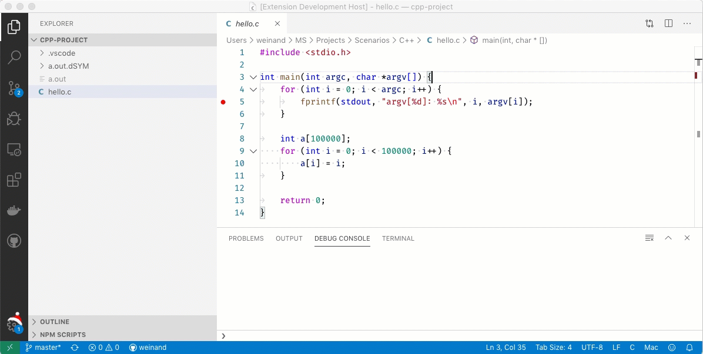

# Augmented-debug README

This sample extension shows how a [`vscode.DebugAdapterTracker`](https://github.com/microsoft/vscode/blob/b6ae21e6e2e7255978993df45c1317a869170d21/src/vs/vscode.d.ts#L9649-L9688) can be used to augment a debug session with additional information.

The following screencast shows a new scope "GPU" in the VARIABLES view that is fed by the extension.
The underlying C++ debugger is unmodified and completely unaware of this.

## Please Note:

The `vscode.DebugAdapterTracker` API was designed to **tap** the communication between VS Code and debug adapters. It was not designed to **modify** messages in transit. So this example actually shows a use case that is not officially supported.

However, we are currently working on another (similar) API that supports intercepting and modifying DAP messages. And as long as this API is not a part of the official VS Code extension API (i.e. `vscode.d.ts`), we will continue to support the "unofficial" use case.

### 1.0.0

Initial release.
